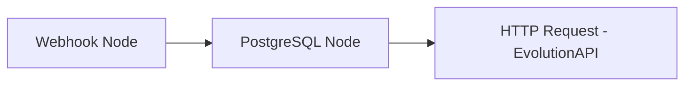

# Plano de Saúde DF - Integração n8n, PostgreSQL e EvolutionAPI

Este projeto contém a landing page refatorada para rodar localmente no seu computador, com suporte integrado a Webhooks para envio de dados em formato JSON.

## Arquivos Criados
1. **[index.html](file:///c:/Users/pedro/Documents/antigravity/keen-einstein/index.html)**: O site contendo o formulário de 4 etapas construído com Tailwind CSS e Alpine.js.
2. **[config.js](file:///c:/Users/pedro/Documents/antigravity/keen-einstein/config.js)**: Arquivo de configuração onde você define a URL do Webhook do seu n8n e outras opções (como números de contato do WhatsApp).

---

## 🚀 Como Executar Localmente
Você pode abrir o arquivo `index.html` diretamente em qualquer navegador, ou rodar um servidor local simples na pasta do projeto:

```bash
# Se tiver Python instalado
python -m http.server 8000

# Se tiver Node.js instalado (usando http-server)
npx http-server -p 8000
```
Depois, basta acessar `http://localhost:8000`.

---

## 🛠️ Configuração da Integração

### 1. No Frontend (`config.js`)
Abra o arquivo [config.js](file:///c:/Users/pedro/Documents/antigravity/keen-einstein/config.js) e altere as variáveis:

*   **`N8N_WEBHOOK_URL`**: A URL que o n8n gera ao criar um nó de Webhook (lembre-se de usar a URL de produção no n8n quando colocar no ar).
*   **`REDIRECT_TO_WHATSAPP`**: Se definido como `true`, além de enviar para o n8n, o site abrirá o WhatsApp do cliente com uma mensagem pronta para mandar para o corretor. Se `false`, o site apenas exibirá a tela de conclusão sem abrir o WhatsApp.
*   **`WHATSAPP_CONTACT_1`** e **`WHATSAPP_CONTACT_2`**: Os números de WhatsApp de destino.

---

### 2. Formato do JSON Enviado para o n8n
Quando o formulário é submetido, o site envia uma requisição `POST` com os cabeçalhos `'Content-Type': 'application/json'` e o corpo no formato abaixo:

```json
{
  "nome": "João da Silva",
  "telefone": "(61) 99999-9999",
  "email": "joao@email.com",
  "cidade": "Brasília/DF",
  "vidas": "3 a 5 pessoas",
  "motivo": "Troca de plano",
  "cnpj": "Sim",
  "data_envio": "2026-08-06T22:57:28Z",
  "mensagem_formatada": "Olá! Acabei de fazer minha cotação no planodsaudedf.com.br 🏥\n\n*Nome:* João da Silva\n*Telefone:* (61) 99999-9999\n*E-mail:* joao@email.com\n*Cidade:* Brasília/DF\n*Vidas:* 3 a 5 pessoas\n*Motivo:* Troca de plano\n*Possui CNPJ:* Sim\n\nAguardo retorno com as melhores opções! 😊"
}
```

---

### 3. Configurando o Banco de Dados PostgreSQL
Para armazenar os leads que chegam pelo site, você pode criar uma tabela no seu banco de dados PostgreSQL com a seguinte estrutura SQL:

```sql
CREATE TABLE leads_planos_saude (
    id SERIAL PRIMARY KEY,
    nome VARCHAR(255) NOT NULL,
    telefone VARCHAR(50) NOT NULL,
    email VARCHAR(255),
    cidade VARCHAR(100),
    vidas VARCHAR(50),
    motivo VARCHAR(100),
    cnpj VARCHAR(10),
    data_envio TIMESTAMP WITH TIME ZONE DEFAULT CURRENT_TIMESTAMP,
    criado_em TIMESTAMP WITH TIME ZONE DEFAULT CURRENT_TIMESTAMP
);
```

---

### 4. Estrutura Recomendada do Fluxo no n8n

O seu fluxo do n8n deve conter os seguintes nós conectados em sequência:



1.  **Nó Webhook (Trigger)**:
    *   **Method**: `POST`
    *   **Path**: `cotacao-lead` (ou o de sua preferência)
    *   **Response Mode**: `On Received` (com Status `200`) ou `Last Node` se você quiser retornar alguma resposta específica para o site.

2.  **Nó PostgreSQL (Insert)**:
    *   **Operation**: `Insert`
    *   **Table**: `leads_planos_saude`
    *   **Columns**: Mapeie os campos que vêm do Webhook (`nome`, `telefone`, `email`, `cidade`, `vidas`, `motivo`, `cnpj`) para as colunas do seu banco PostgreSQL.

3.  **Nó HTTP Request (EvolutionAPI)**:
    *   **Method**: `POST`
    *   **URL**: `https://sua-evolution-api.domain.com/message/sendText/{sua-instancia}`
    *   **Headers**:
        *   `apikey`: `sua-chave-api-da-evolution`
        *   `Content-Type`: `application/json`
    *   **Body (JSON)**:
        ```json
        {
          "number": "5561985475886", // Número do corretor ou ID do grupo do whatsapp
          "options": {
            "delay": 1200,
            "presence": "composing"
          },
          "textMessage": {
            "text": "🚨 *Novo Lead Recebido no Site!* 🚨\n\n{{ $json.mensagem_formatada }}"
          }
        }
        ```
