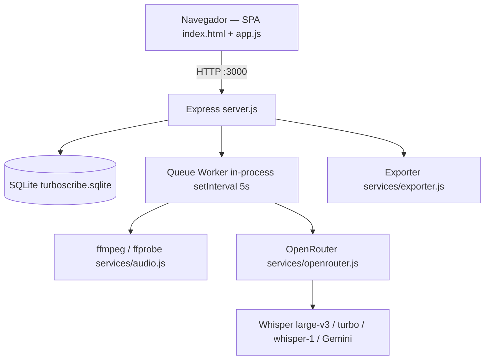

# stack.md — Tecnologias e Infraestrutura

> Inventário técnico real, auditado no código em 14/09/2026. Se divergir do código, o código ganha.

## Visão geral



Monolito de processo único: API HTTP e worker de transcrição rodam no mesmo processo Node. O worker (`services/pipeline.js`) processa **um job por vez**, mas dentro do job transcreve os blocos de áudio em paralelo (`CHUNK_CONCURRENCY`, default 3), com retry por bloco e retomada após queda. Ver [system_design.md](system_design.md) §6 e [MULTIUSER.md](MULTIUSER.md).

## Runtime e dependências

| Camada | Tecnologia | Onde |
|---|---|---|
| Runtime | Node.js 20 (alpine) | `Dockerfile` |
| HTTP | Express 4.21 | `server.js` (758 linhas) |
| Upload | Multer 1.4 (disk storage em `uploads/`) | `server.js:26` |
| Auth | jsonwebtoken 9 (HS256, exp 30d) + bcryptjs 2.4 | `server.js:51` |
| Banco | SQLite3 5.1 (arquivo único, sem WAL) | `db.js` (260 linhas) |
| Áudio | ffmpeg / ffprobe (binário de sistema via `apk add`, invocados por `spawn`) | `services/audio.js` |
| Fila / worker | Worker in-process, blocos persistidos em `transcription_chunks` | `services/pipeline.js` |
| IA | OpenRouter API (`node-fetch` 2 + `form-data` 4); provedor `mock` para testes | `services/openrouter.js` |
| Exportação | `pdfkit` 0.16, `docx` 9.1, geradores próprios SRT/VTT/TXT | `services/exporter.js` (179 linhas) |
| Front | Tailwind via CDN + Lucide Icons + JS vanilla, sem build step | `index.html` (929 linhas), `app.js` (1617 linhas) |
| Infra | Docker + docker compose, labels Traefik | `Dockerfile`, `docker-compose.yml` |

Sem framework de front, sem bundler, sem TypeScript, sem ORM, sem Redis, sem fila externa — proposital, baixo custo operacional.

## Modelo de dados (SQLite)

```
users(id, name, email UNIQUE, password_hash, role, daily_limit, status, created_at)
api_keys(id, provider, name, key_value, is_active, created_at)
system_settings(key PK, value)
system_logs(id, user_id, action, details, ip_address, timestamp)
projects(id, user_id → users, name, created_at)
transcriptions(id, user_id → users, project_id → projects, file_name, file_path,
               file_size, duration_seconds, language, mode, status, stage, raw_text,
               speaker_diarization, progress, error_message, ai_summary,
               created_at, updated_at)
segments(id, transcription_id → transcriptions, speaker, start_time, end_time, text)
transcription_chunks(id, transcription_id → transcriptions, idx, offset_sec, duration_sec,
               path, status, attempts, model_used, segments_json, error,
               started_at, finished_at)   -- índice (transcription_id, idx)
```

- Migrações imperativas e idempotentes em `initDatabase()` (`db.js:44`): renomeia `folders`→`projects`, `folder_id`→`project_id`, adiciona colunas via `PRAGMA table_info`.
- `status` da transcrição: `pending` → `processing` → `completed` | `completed_with_errors` | `failed`. `stage` (só durante `processing`): `preprocessing` → `splitting` → `transcribing` → `assembling` → `analyzing`.
- `transcription_chunks.status`: `pending` → `processing` → `done` | `failed`. Bloco `done` guarda `segments_json` (timestamps relativos ao bloco; `offset_sec` é somado na montagem). Blocos são apagados do disco ao concluir o job, mas as linhas ficam (permitem `/retry` e auditoria).
- Sem índice em `transcriptions.user_id`, `transcriptions.status`, `segments.transcription_id`. O worker faz `SELECT ... WHERE status IN ('processing','pending')` a cada 5s — full scan (T-08).

## Superfície de API

Todas as rotas em `server.js`, prefixo `/api`.

| Método | Rota | Auth | Filtra por usuário? |
|---|---|---|---|
| POST | `/api/auth/login` | pública | — |
| GET | `/api/auth/me` | token | — |
| GET/POST/DELETE | `/api/projects[/:id]` | token | ❌ não |
| GET | `/api/transcriptions` | token | ❌ não |
| GET/PUT/DELETE | `/api/transcriptions/:id` | token | ❌ não |
| GET | `/api/transcriptions/:id/status` | token | ❌ não — devolve `stage`, `chunks_done/total/failed`, `eta_seconds` |
| POST | `/api/transcriptions/:id/retry` | token | ❌ não — reprocessa só os blocos `failed` |
| POST | `/api/transcribe` | token | grava `user_id`, mas não valida cota; valida com `ffprobe` por arquivo |
| GET | `/api/export/:id/:format` | token | ❌ não |
| POST | `/api/chat`, `/api/translate` | token | ❌ não |
| GET | `/api/openrouter/models`, `/api/settings` | pública | — |
| GET/POST/PUT/DELETE | `/api/admin/*` | token + `requireAdmin` | — |

## Configuração e segredos

| Variável | Origem | Default perigoso? |
|---|---|---|
| `PORT` | `.env` / compose | não |
| `JWT_SECRET` | `.env` / compose | ⚠️ sim — cai em string hardcoded em `server.js:18` e no `docker-compose.yml` |
| `OPENROUTER_API_KEY` | `.env`, sincronizada para `api_keys` no boot | não |

`.env`, `turboscribe.sqlite` e `uploads/` estão no `.gitignore`.

## Volumes e persistência

```yaml
volumes:
  - .:/app                                  # bind-mount de código (hot reload de .js)
  - /app/node_modules                       # anonymous volume, preserva deps da imagem
  - ./turboscribe.sqlite:/app/turboscribe.sqlite
  - ./uploads:/app/uploads
```

O bind-mount publica **código**, nunca **binários de sistema**. Mudou o `Dockerfile` → `docker compose build`. Mudou só `.js` → `docker compose restart transcreveai`. Detalhe em [pipeline.md](../pipeline.md).

## Limites técnicos conhecidos

| Limite | Valor | Onde |
|---|---|---|
| Jobs simultâneos | 1 (global); blocos do job em paralelo: `CHUNK_CONCURRENCY` (3) | `services/pipeline.js` |
| Tentativas por bloco | `CHUNK_MAX_ATTEMPTS` (3), backoff 2 s / 8 s / 30 s | `services/pipeline.js` |
| Timeout por chamada de transcrição | `TRANSCRIBE_TIMEOUT_MS` (10 min) | `services/openrouter.js` |
| Poll da fila | 5 s | `services/pipeline.js` |
| Tamanho de bloco de áudio | `CHUNK_TARGET_SEC` (600 s), corte no silêncio mais próximo | `services/pipeline.js` |
| Body JSON | 100 MB | `server.js` |
| Upload | `MAX_UPLOAD_GB` (5) por arquivo, `MAX_FILES_PER_UPLOAD` (50), `MAX_AUDIO_HOURS` (10) | `server.js` (Multer + `ffprobe`) |
| Disco | recusa iniciar se livre < 2× o tamanho do arquivo | `services/pipeline.js` |
| Escritas simultâneas SQLite | serializadas, sem WAL → risco de `SQLITE_BUSY` sob carga | `db.js:7` |

## Ver também
- [product.md](product.md) — o que o sistema entrega
- [system_design.md](system_design.md) — arquitetura e decisões de design
- [MULTIUSER.md](MULTIUSER.md) — auditoria de segurança e capacidade

## Edicao de transcricao (T-04, 20/09/2026)

`PUT /api/transcriptions/:id` aceita `{segments: [{id, text}]}` para editar o texto dos segmentos. Exige todos os IDs da transcricao, sem duplicados, com texto string (inclusive vazio). O servidor ordena os segmentos pelo timestamp e recompoe `raw_text` com paragrafos. Timestamps e falantes sao preservados. Metadados devem ser salvos em requisicao separada; o contrato legado de `raw_text` permanece para texto sem segmentos e clientes antigos.

`services/transcript-editor.js` usa conexao SQLite dedicada, `BEGIN IMMEDIATE`, commit e rollback, evitando intercalar a transacao com escritas do worker. Nao altera schema. Respostas: 200 com `raw_text` e `segments`, 400 para payload/IDs invalidos, 404 para transcricao inexistente, 409 durante processamento. O isolamento por dono continua na T-02.
