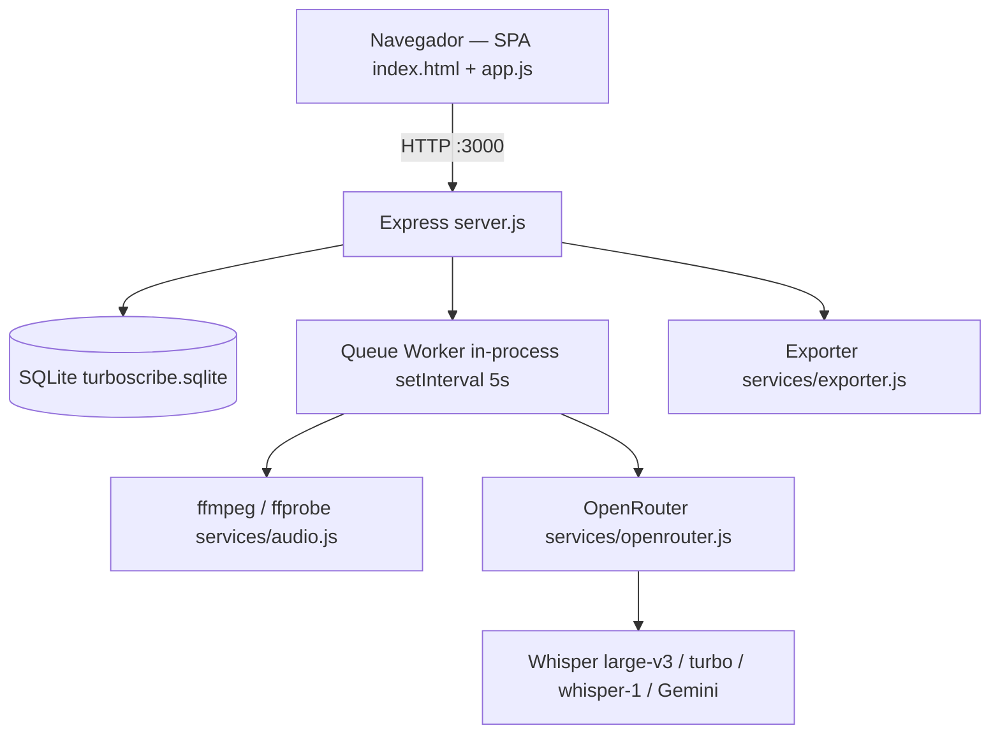

# stack.md — Tecnologias e Infraestrutura

> Inventário técnico real, auditado no código em 14/09/2026. Se divergir do código, o código ganha.

## Visão geral



Monolito de processo único: API HTTP e worker de transcrição rodam no mesmo processo Node, com trava global `isWorkerRunning` (`server.js:594`). Isso define o teto de capacidade — ver [docs/MULTIUSER.md](MULTIUSER.md).

## Runtime e dependências

| Camada | Tecnologia | Onde |
|---|---|---|
| Runtime | Node.js 20 (alpine) | `Dockerfile` |
| HTTP | Express 4.21 | `server.js` (758 linhas) |
| Upload | Multer 1.4 (disk storage em `uploads/`) | `server.js:26` |
| Auth | jsonwebtoken 9 (HS256, exp 30d) + bcryptjs 2.4 | `server.js:51` |
| Banco | SQLite3 5.1 (arquivo único, sem WAL) | `db.js` (260 linhas) |
| Áudio | ffmpeg / ffprobe (binário de sistema via `apk add`) | `services/audio.js` (225 linhas) |
| IA | OpenRouter API (`node-fetch` 2 + `form-data` 4) | `services/openrouter.js` (272 linhas) |
| Exportação | `pdfkit` 0.16, `docx` 9.1, geradores próprios SRT/VTT/TXT | `services/exporter.js` (179 linhas) |
| Front | Tailwind via CDN + Lucide Icons + JS vanilla, sem build step | `index.html` (929 linhas), `app.js` (1617 linhas) |
| Infra | Docker + docker compose, labels Traefik | `Dockerfile`, `docker-compose.yml` |

Sem framework de front, sem bundler, sem TypeScript, sem ORM, sem Redis, sem fila externa — proposital, baixo custo operacional.

## Modelo de dados (SQLite)

```
users(id, name, email UNIQUE, password_hash, role, daily_limit, status, created_at)
api_keys(id, provider, name, key_value, is_active, created_at)
system_settings(key PK, value)
system_logs(id, user_id, action, details, ip_address, timestamp)
projects(id, user_id → users, name, created_at)
transcriptions(id, user_id → users, project_id → projects, file_name, file_path,
               file_size, duration_seconds, language, mode, status, raw_text,
               speaker_diarization, progress, error_message, ai_summary,
               created_at, updated_at)
segments(id, transcription_id → transcriptions, speaker, start_time, end_time, text)
```

- Migrações imperativas e idempotentes em `initDatabase()` (`db.js:44`): renomeia `folders`→`projects`, `folder_id`→`project_id`, adiciona colunas via `PRAGMA table_info`.
- `status` da transcrição: `pending` → `processing` → `completed` | `failed`.
- Sem índice em `transcriptions.user_id`, `transcriptions.status`, `segments.transcription_id`. O worker faz `SELECT ... WHERE status='pending'` a cada 5s — full scan.

## Superfície de API

Todas as rotas em `server.js`, prefixo `/api`.

| Método | Rota | Auth | Filtra por usuário? |
|---|---|---|---|
| POST | `/api/auth/login` | pública | — |
| GET | `/api/auth/me` | token | — |
| GET/POST/DELETE | `/api/projects[/:id]` | token | ❌ não |
| GET | `/api/transcriptions` | token | ❌ não |
| GET/PUT/DELETE | `/api/transcriptions/:id` | token | ❌ não |
| GET | `/api/transcriptions/:id/status` | token | ❌ não |
| POST | `/api/transcribe` | token | grava `user_id`, mas não valida cota |
| GET | `/api/export/:id/:format` | token | ❌ não |
| POST | `/api/chat`, `/api/translate` | token | ❌ não |
| GET | `/api/openrouter/models`, `/api/settings` | pública | — |
| GET/POST/PUT/DELETE | `/api/admin/*` | token + `requireAdmin` | — |

## Configuração e segredos

| Variável | Origem | Default perigoso? |
|---|---|---|
| `PORT` | `.env` / compose | não |
| `JWT_SECRET` | `.env` / compose | ⚠️ sim — cai em string hardcoded em `server.js:18` e no `docker-compose.yml` |
| `OPENROUTER_API_KEY` | `.env`, sincronizada para `api_keys` no boot | não |

`.env`, `turboscribe.sqlite` e `uploads/` estão no `.gitignore`.

## Volumes e persistência

```yaml
volumes:
  - .:/app                                  # bind-mount de código (hot reload de .js)
  - /app/node_modules                       # anonymous volume, preserva deps da imagem
  - ./turboscribe.sqlite:/app/turboscribe.sqlite
  - ./uploads:/app/uploads
```

O bind-mount publica **código**, nunca **binários de sistema**. Mudou o `Dockerfile` → `docker compose build`. Mudou só `.js` → `docker compose restart transcreveai`. Detalhe em [pipeline.md](../pipeline.md).

## Limites técnicos conhecidos

| Limite | Valor | Onde |
|---|---|---|
| Concorrência de transcrição | 1 job por vez, global | `server.js:594` (`isWorkerRunning`) |
| Poll da fila | 5 s | `server.js:750` |
| Tamanho de bloco de áudio | 600 s | `CHUNK_TARGET_SEC` |
| Body JSON | 100 MB | `server.js:37` |
| Upload | sem limite no Multer | `server.js:33` |
| Escritas simultâneas SQLite | serializadas, sem WAL → risco de `SQLITE_BUSY` sob carga | `db.js:7` |

## Ver também
- [product.md](product.md) — o que o sistema entrega
- [system_design.md](system_design.md) — arquitetura e decisões de design
- [MULTIUSER.md](MULTIUSER.md) — auditoria de segurança e capacidade
