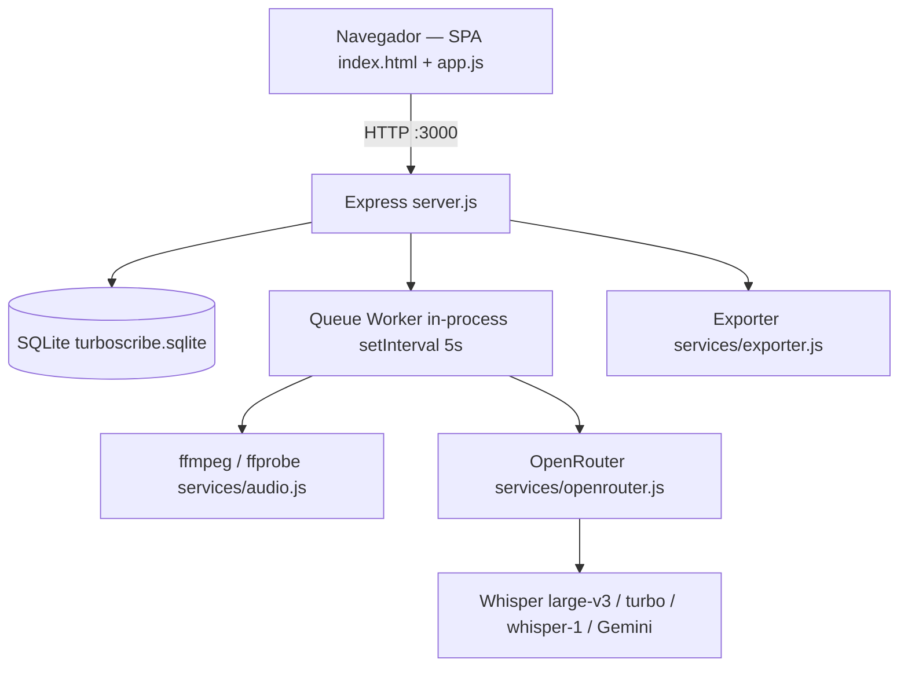

# stack.md — Tecnologias e Infraestrutura

> Inventário técnico real, auditado no código em 14/09/2026. Se divergir do código, o código ganha.

## Visão geral


```mermaid
graph TD
    B[Navegador — SPA index.html + app.js] -->|HTTP :3000| E[Express server.js]
    E --> DB[(SQLite turboscribe.sqlite)]
    E --> W[Queue Worker in-process setInterval 5s]
    W --> FF[ffmpeg / ffprobe services/audio.js]
    W --> OR[OpenRouter services/openrouter.js]
    E --> EX[Exporter services/exporter.js]
    OR --> WH[Whisper large-v3 / turbo / whisper-1 / Gemini]
```

Monolito de processo único: API HTTP e worker de transcrição rodam no mesmo processo Node. O worker (`services/pipeline.js`) processa **N jobs em paralelo** (`WORKER_CONCURRENCY`, env, default 2 — T-06), com claim atômico condicional e recuperação de jobs travados no boot (volta pra `pending`, máx 3 tentativas); dentro de cada job transcreve os blocos de áudio em paralelo (`CHUNK_CONCURRENCY`, default 3), com retry por bloco e retomada após queda. Jobs `pending` expõem `queue_position` (ordem na fila) em `GET /api/transcriptions` e em `GET /:id/status` — é o "Nº na fila" da UI. Ver [system_design.md](system_design.md) §6 e [MULTIUSER.md](MULTIUSER.md).

## Runtime e dependências

| Camada | Tecnologia | Onde |
|---|---|---|
| Runtime | Node.js 20 (alpine) | `Dockerfile` |
| HTTP | Express 4.21 | `server.js` (758 linhas) |
| Upload | Multer 1.4 (disk storage em `uploads/`) | `server.js:26` |
| Auth | jsonwebtoken 9 (HS256, exp 30d) + bcryptjs 2.4 | `server.js:51` |
| Banco | SQLite3 5.1 (arquivo único, sem WAL) | `db.js` (260 linhas) |
| Áudio | ffmpeg / ffprobe (binário de sistema via `apk add`, invocados por `spawn`) | `services/audio.js` |
| Fila / worker | Worker in-process, blocos persistidos em `transcription_chunks` | `services/pipeline.js` |
| IA | OpenRouter API (`node-fetch` 2 + `form-data` 4); provedor `mock` para testes | `services/openrouter.js` |
| Exportação | `pdfkit` 0.16, `docx` 9.1, geradores próprios SRT/VTT/TXT | `services/exporter.js` (179 linhas) |
| Front | Tailwind via CDN + Lucide Icons + JS vanilla, sem build step | `index.html` (929 linhas), `app.js` (1617 linhas) |
| Infra | Docker + docker compose, labels Traefik | `Dockerfile`, `docker-compose.yml` |

Sem framework de front, sem bundler, sem TypeScript, sem ORM, sem Redis, sem fila externa — proposital, baixo custo operacional.

## Modelo de dados (SQLite)

```
users(id, name, email UNIQUE, password_hash, role, daily_limit, status, created_at)
api_keys(id, provider, name, key_value, is_active, created_at)
system_settings(key PK, value)  -- níveis: base_model/enabled, pro_model/enabled, max_model/enabled; análise: analysis_model, analysis_prompt
glossary(id, wrong, correct, created_at)  -- T-18: dicionário de correções aplicado no aprimoramento
ai_analyses(id, transcription_id → transcriptions, kind, model, prompt_used,
            glossary_used, result_md, tokens_in, tokens_out, cost_usd, created_at)  -- T-18
system_logs(id, user_id, action, details, ip_address, timestamp)
projects(id, user_id → users, name, created_at)
transcriptions(id, user_id → users, project_id → projects, file_name, file_path,
               file_size, duration_seconds, language, mode, status, stage, raw_text,
               speaker_diarization, progress, error_message, ai_summary,
               created_at, updated_at)
segments(id, transcription_id → transcriptions, speaker, start_time, end_time, text)
transcription_chunks(id, transcription_id → transcriptions, idx, offset_sec, duration_sec,
               path, status, attempts, model_used, segments_json, error,
               detected_language,   -- T-20: idioma que o Whisper detectou no bloco (language='auto')
               started_at, finished_at)   -- índice (transcription_id, idx)
```

- Migrações imperativas e idempotentes em `initDatabase()` (`db.js:44`): renomeia `folders`→`projects`, `folder_id`→`project_id`, adiciona colunas via `PRAGMA table_info`.
- `DB_PATH` (env) troca o caminho do SQLite — usado pelos testes para isolar o banco (`tests/t20_formats_languages.js`); sem ele, usa `turboscribe.sqlite` no diretório do projeto.
- `transcriptions.language`: `auto` (padrão, T-20) vira o idioma detectado pelo Whisper ao concluir; código ISO-639-1 quando o usuário escolhe. Lista canônica em `services/languages.js` (100 idiomas), servida também ao frontend em `GET /languages.js`.
- `status` da transcrição: `pending` → `processing` → `completed` | `completed_with_errors` | `failed`. `stage` (só durante `processing`): `preprocessing` → `splitting` → `transcribing` → `assembling` → `analyzing`.
- `transcription_chunks.status`: `pending` → `processing` → `done` | `failed`. Bloco `done` guarda `segments_json` (timestamps relativos ao bloco; `offset_sec` é somado na montagem). Blocos são apagados do disco ao concluir o job, mas as linhas ficam (permitem `/retry` e auditoria).
- Sem índice em `transcriptions.user_id`, `transcriptions.status`, `segments.transcription_id`. O worker faz `SELECT ... WHERE status IN ('processing','pending')` a cada 5s — full scan (T-08).

## Superfície de API

Todas as rotas em `server.js`, prefixo `/api`.

| Método | Rota | Auth | Filtra por usuário? |
|---|---|---|---|
| POST | `/api/auth/login` | pública | — |
| GET | `/api/auth/me` | token | — |
| GET/POST/DELETE | `/api/projects[/:id]` | token | ✅ dono (admin: `?all=true`) |
| GET | `/api/transcriptions` | token | ✅ dono (admin: `?all=true`) |
| GET/PUT/DELETE | `/api/transcriptions/:id` | token | ✅ dono — alheio retorna 404 |
| GET | `/api/transcriptions/:id/status` | token | ✅ dono — inclui `queue_position` (T-06) |
| POST | `/api/transcriptions/:id/retry` | token | ✅ dono |
| POST | `/api/transcribe` | token | T-07: `checkDailyQuota` (429 ao exceder `daily_limit` nas últimas 24 h); multer montado por request com `fileSize` de `system_settings.max_file_size_mb`; valida duração com `ffprobe` contra `max_duration_hours` |
| GET | `/api/export/:id/:format` | token | ✅ dono |
| GET | `/api/transcriptions/:id/audio` | token (aceita `?token=` para `<audio>`) | ✅ dono — T-13: áudio original com `Content-Disposition` do nome original; suporta `Range` (206 p/ seek) |
| POST | `/api/export/bulk` | token | T-13: `{ids, format}` → um `.zip` em stream (`archiver`); item alheio/inexistente vai para `_erros.txt` sem abortar o lote; máx. 100 itens |
| GET | `/uploads/:file` | token (aceita `?token=` para `<audio>`) | ✅ valida dono via `file_path` no banco; fora de escopo → 404 (T-13: player usa a rota autenticada acima; mantida p/ retrocompatibilidade) |
| POST | `/api/chat`, `/api/translate` | token | ✅ valida `transcription_id` do body quando enviado |
| POST | `/api/transcriptions/:id/enhance` | token | ✅ dono — T-18 aprimora o texto via LLM; **T-25: juiz (JEV) valida cada chunk antes da entregar** (1 retry com feedback se reprovar; `judge_model`/`judge_enabled` no admin); custo em tokens |
| GET | `/api/transcriptions/:id/analyses` | token | ✅ dono — T-18: histórico de aprimoramentos |
| GET | `/api/glossary` | token | T-18: dicionário de correções |
| POST/DELETE | `/api/admin/glossary(/:id)` | token + `requireAdmin` | T-18: CRUD do dicionário |
| GET | `/api/openrouter/models`, `/api/settings` | pública | — |
| GET/POST/PUT/DELETE | `/api/admin/*` | token + `requireAdmin` (role/status lidos do banco a cada request — promoção/suspensão valem na hora, sem novo login) | — |

## Configuração e segredos

| Variável | Origem | Default perigoso? |
|---|---|---|
| `PORT` | `.env` / compose | não |
| `JWT_SECRET` | `.env` / compose | ⚠️ sim — cai em string hardcoded em `server.js:18` e no `docker-compose.yml` |
| `OPENROUTER_API_KEY` | `.env`, sincronizada para `api_keys` no boot | não |
| `WORKER_CONCURRENCY` | `.env` | não — default 2; jobs de transcrição processados em paralelo (T-06) |
| `POSTGRES_USER` / `POSTGRES_PASSWORD` / `POSTGRES_DB` | `.env` / compose | ⚠️ senha tem default de dev — obrigatório trocar em produção (T-08, service `db`) |
| `DB_DRIVER` | `.env` / compose | não — `sqlite` (default, produção atual) ou `postgres`; cutover T-08 |
| `DATABASE_URL` | `.env` | driver postgres (e ETL): sobrescreve as vars `PG*`; sem ela usa `PGHOST`/`PGPORT`/`PGUSER`/`PGPASSWORD`/`PGDATABASE` (defaults apontam pro service `db`) |

`.env`, `turboscribe.sqlite` e `uploads/` estão no `.gitignore`.

## Volumes e persistência

```yaml
volumes:
  - .:/app                                  # bind-mount de código (hot reload de .js)
  - /app/node_modules                       # anonymous volume, preserva deps da imagem
  - ./uploads:/app/uploads
```

O bind-mount publica **código**, nunca **binários de sistema**. Mudou o `Dockerfile` → `docker compose build`. Mudou só `.js` → `docker compose restart transcreveai`. Detalhe em [pipeline.md](../pipeline.md).

⚠️ **Nunca usar bind de arquivo único** (`./turboscribe.sqlite:/app/turboscribe.sqlite`): se o arquivo for substituído no host (backup restore, mv/cp), o container segue o inode antigo e abre nada (SQLITE_CANTOPEN). O banco resolve pelo bind do diretório (`.:/app`).

**Journal mode = DELETE (desde 25/09; era WAL).** WAL faz mmap de `-wal`/`-shm`, e o bind-mount Windows do Docker Desktop (gRPC-FUSE) corrompe a imagem em shutdown abrupto — causou o incidente SQLITE_CORRUPT de 25/09. Custo: um writer por vez (mitigado por `busy_timeout=5000`; o worker já é serial).

**T-08 (28–29/09): migração para PostgreSQL completa.** O problema real não era o WAL — é o writer único do SQLite, que não escala aos 35 mil usuários mirados. Fase 1 (28/09): service `db` (postgres:16-alpine, volume nomeado `pgdata`, healthcheck `pg_isready`) e ETL `scripts/migrate-sqlite-to-postgres.js` (fonte READONLY, transação única, validação de contagens, `--dry-run`/`--force`). Fase 2 (29/09): driver swap em `db.js` (`DB_DRIVER=sqlite|postgres`) — tradução de placeholders/booleanos, DDL compartilhado com o ETL, dialeto da fila/pipeline/quota/settings portabilizado, `transcript-editor.js` migrado (antes abria SQLite próprio). App verificado de ponta a ponta contra o Postgres (`tests/t08_driver_postgres.js`, 26/26) e sem regressão no SQLite (79/79). **Cutover realizado em 29/09:** app local agora roda 100% no Postgres. O ETL foi reforçado com sanitização de FK (o SQLite nunca teve FK ativa: 194 registros órfãos em `system_logs` tiveram `user_id`/`project_id` → NULL, com contagem impressa; FKs de `transcription_id` permanecem estritas). Resultado: **3.518 linhas, 10 tabelas, contagens idênticas**; `.env` com `DB_DRIVER=postgres`; suíte completa **79/79 contra o Postgres**. Rollback = comentar `DB_DRIVER` (ressalva: dados gravados no Postgres após o ETL não voltam sozinhos pro SQLite — o arquivo `turboscribe.sqlite` ficou intacto como snapshot).

## Limites técnicos conhecidos

| Limite | Valor | Onde |
|---|---|---|
| Jobs simultâneos | 1 (global); blocos do job em paralelo: `CHUNK_CONCURRENCY` (3) | `services/pipeline.js` |
| Tentativas por bloco | `CHUNK_MAX_ATTEMPTS` (3), backoff 2 s / 8 s / 30 s | `services/pipeline.js` |
| Timeout por chamada de transcrição | `TRANSCRIBE_TIMEOUT_MS` (10 min) | `services/openrouter.js` |
| Poll da fila | 5 s | `services/pipeline.js` |
| Tamanho de bloco de áudio | `CHUNK_TARGET_SEC` (600 s), corte no silêncio mais próximo | `services/pipeline.js` |
| Body JSON | 100 MB | `server.js` |
| Upload | `MAX_UPLOAD_GB` (5) por arquivo, `MAX_FILES_PER_UPLOAD` (50), `MAX_AUDIO_HOURS` (10) | `server.js` (Multer + `ffprobe`) |
| Disco | recusa iniciar se livre < 2× o tamanho do arquivo | `services/pipeline.js` |
| Escritas simultâneas SQLite | serializadas, sem WAL → risco de `SQLITE_BUSY` sob carga | `db.js:7` |

## Ver também
- [product.md](product.md) — o que o sistema entrega
- [system_design.md](system_design.md) — arquitetura e decisões de design
- [MULTIUSER.md](MULTIUSER.md) — auditoria de segurança e capacidade

## Edicao de transcricao (T-04, 20/09/2026)

`PUT /api/transcriptions/:id` aceita `{segments: [{id, text}]}` para editar o texto dos segmentos. Exige todos os IDs da transcricao, sem duplicados, com texto string (inclusive vazio). O servidor ordena os segmentos pelo timestamp e recompoe `raw_text` com paragrafos. Timestamps e falantes sao preservados. Metadados devem ser salvos em requisicao separada; o contrato legado de `raw_text` permanece para texto sem segmentos e clientes antigos.

`services/transcript-editor.js` usa conexao SQLite dedicada, `BEGIN IMMEDIATE`, commit e rollback, evitando intercalar a transacao com escritas do worker. Nao altera schema. Respostas: 200 com `raw_text` e `segments`, 400 para payload/IDs invalidos, 404 para transcricao inexistente, 409 durante processamento. O isolamento por dono continua na T-02.
