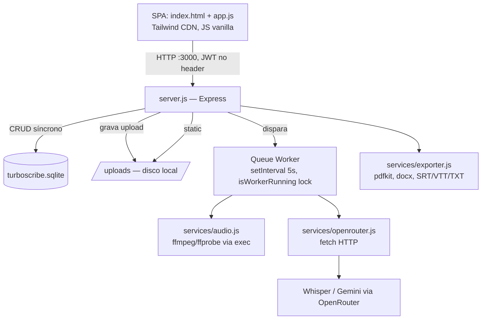

# system_design.md — Arquitetura e Decisões de Design

> Como as peças internas se conectam, por que foram desenhadas assim, e quais os tradeoffs assumidos conscientemente. Complementa [stack.md](stack.md) (inventário) com o raciocínio por trás das escolhas.

## Diagrama de componentes



## Decisões de design e o tradeoff aceito

### 1. Monolito de processo único (API + worker no mesmo processo Node)
**Decisão:** o worker de transcrição roda dentro do processo Express via `setInterval`, protegido por uma flag booleana `isWorkerRunning` (`server.js:594`), em vez de um processo separado ou fila externa (BullMQ/Redis).
**Por quê:** menor custo operacional e de infraestrutura — um único container, sem serviço adicional para manter.
**Tradeoff aceito:** concorrência de transcrição = 1 job global. `ffmpeg` roda via `exec` síncrono, competindo com o event loop do Express — a UI de outros usuários pode ficar lenta durante o pré-processamento. Ver [MULTIUSER.md](MULTIUSER.md) §B-04.
**Quando revisitar:** se o volume de uploads simultâneos crescer além de "alguns por dia por poucos usuários", extrair o worker para processo/serviço separado.

### 2. SQLite como único banco, sem WAL
**Decisão:** arquivo único `turboscribe.sqlite`, sem `PRAGMA journal_mode=WAL`.
**Por quê:** zero infraestrutura de banco, backup é copiar um arquivo.
**Tradeoff aceito:** escritas concorrentes (worker atualizando `progress` + usuários escrevendo) arriscam `SQLITE_BUSY` sob carga. Sem índices em `transcriptions.user_id/status` nem `segments.transcription_id` — cada poll da fila é um full scan.
**Incidente 25/09:** WAL sobre bind-mount Windows corrompeu a imagem (SQLITE_CORRUPT) no shutdown abrupto do Docker Desktop. Recuperado com `.recover` (97 transcrições do dono preservadas, 2 termos de glossário e 6 análises de IA órfãs). Journal mode trocado para DELETE + `busy_timeout=5000` em `db.js`. A saída definitiva é o banco em volume nomeado (T-24).
**Quando revisitar:** antes de qualquer teste de carga com múltiplos usuários reais simultâneos (ver [MULTIUSER.md](MULTIUSER.md) §5).

### 3. Auth com fallback silencioso para admin (T-01, fechado em 22/09/2026)
**Decisão original:** `authenticateToken` tratava requisição sem header `Authorization` como usuário admin local.
**Por quê:** conveniência de desenvolvimento local single-tenant (uso original do sistema — só o dono operando).
**Estado atual (T-01):** o fallback foi removido — requisição sem token válido recebe 401; senhas mestras hardcoded saíram do login; há rate limit de senha na troca de chave de API. Era o bloqueador de segurança nº 1 (ver [MULTIUSER.md](MULTIUSER.md) §B-01/B-02); validado por `test_suite.js` (79/79) e fase A do `load_multiuser.js` (6/6).
**Correção 24/09:** `requireAdmin` deixou de confiar no `role` congelado no JWT (30d de expiração) e passa a ler `role`/`status` do banco a cada request. Sem isso, uma promoção a admin só valia após novo login (painel SaaS exibia `undefined` nas métricas com token antigo) e um admin rebaixado/suspenso mantia poder até o token expirar. Suspensão e rebaixamento passam a valer imediatamente.
**Correção 25/09:** o mesmo vale para `authenticateToken` — toda request autenticada valida `status`/`role` no banco (1 SELECT; custo irrelevante no scale atual). Usuário suspenso é cortado em todas as rotas, não só nas de admin; promoção a admin vale sem novo login.

### 4. Queries filtradas por `user_id` (T-02, fechado em 24/09/2026)
**Decisão original:** todas as rotas de dados (`/api/projects`, `/api/transcriptions`, `/api/export`) liam/escreviam sem cláusula `WHERE user_id = ?`, embora a coluna existisse e fosse gravada.
**Por quê:** o schema já antecipava multiusuário, mas a camada de rotas nunca chegou a aplicar o filtro — o produto era usado por uma pessoa só.
**Estado atual (T-02):** helpers `scopeOf(req)`/`ownedTranscription(id, scope)` aplicam tenancy em todas as rotas de dados, `/uploads/:file` é autenticado e valida o dono via `file_path` no banco, e acesso a recurso alheio retorna 404 (não revela existência). Admin vê tudo apenas com `?all=true`. Validação: `load_multiuser.js` 13/13 PASS (ver [MULTIUSER.md](MULTIUSER.md) §8).

### 5. Front-end sem build step
**Decisão:** `index.html` + `app.js` em JS vanilla, Tailwind via CDN, sem bundler/TypeScript/framework.
**Por quê:** zero tempo de build, zero dependência de toolchain de front, deploy = servir arquivos estáticos direto do Express.
**Tradeoff aceito:** sem type-safety, sem tree-shaking, `app.js` já em 1617 linhas num único arquivo. Cache-busting manual via query string na tag `<script>` (`?v=X.Y.Z`).
**Quando revisitar:** se a complexidade de estado da SPA continuar crescendo além do que um único arquivo suporta legivelmente.

### 6. Pipeline de transcrição: o bloco é a unidade de trabalho
**Decisão:** áudio passa por `ffmpeg` (16 kHz mono FLAC + `loudnorm`), é dividido em blocos de ~600 s cortados no silêncio mais próximo, e **cada bloco vira uma linha em `transcription_chunks`**. O worker (`services/pipeline.js`) transcreve os blocos pendentes em paralelo (`CHUNK_CONCURRENCY`, default 3), persiste cada resultado assim que chega, tenta de novo em erro transitório (429/5xx/rede, backoff 2 s → 8 s → 30 s), e marca só o bloco em erro definitivo. A montagem lê os blocos na ordem, soma o `offset_sec` aos timestamps e, para bloco falho, insere `[bloco N falhou: motivo]` no lugar do trecho.
**Por quê:** o caso de uso é 8 h de áudio por dia. Com blocos em série e sem persistência (estado anterior a 15/09/2026), uma falha na chamada 40 de 48 jogava fora 39 blocos prontos — e 8 h levavam ~45 min. Agora: ~15 min, e qualquer queda retoma de onde parou.
**Retomada:** o worker seleciona jobs `processing` antes de `pending`; um job `processing` com o worker livre é resto de execução interrompida. Blocos presos em `processing` voltam a `pending`; blocos `done` nunca são refeitos. `POST /:id/retry` reseta só os `failed`.
**Tradeoff aceito:** um job por vez (a concorrência é intra-job) — 50 arquivos enviados juntos ainda entram em fila serial (T-06). Blocos ficam em disco (`uploads/chunks_<id>/`, ~2× o tamanho do original no pico) até o job terminar. `filterHallucinations` roda na montagem, sobre o todo — um bloco isolado não é filtrado.
**Testado sem custo:** `TRANSCRIBE_PROVIDER=mock` substitui a OpenRouter por segmentos determinísticos prefixados `[MOCK]` (recusado em produção); `tests/long_audio.js` cobre paralelismo, retry, falha definitiva, kill+retomada, responsividade e limites de upload contra um áudio de 2 h.
**Detalhe completo:** [../pipeline.md](../pipeline.md).

### 7. Bind-mount Docker para código, imagem para binários
**Decisão:** `.:/app` como bind-mount (hot-reload de `.js` só com `restart`), mas dependências de sistema (`ffmpeg`) só entram via rebuild de imagem.
**Por quê:** ciclo de iteração rápido para lógica de aplicação sem pagar o custo de rebuild a cada mudança de `.js`.
**Tradeoff aceito — já causou incidente real (31/08/2026):** código novo parece implantado (está, via mount) enquanto o binário que ele invoca não existe na imagem antiga, causando falha silenciosa até o primeiro job rodar.
**Regra operacional:** mexeu no `Dockerfile` → `docker compose build`. Mexeu só em `.js` → `docker compose restart transcreveai`.

## Fluxo de dados: do upload ao resultado

```mermaid
sequenceDiagram
    participant U as Usuário (SPA)
    participant S as server.js
    participant DB as SQLite
    participant W as Worker (5s poll)
    participant A as ffmpeg (audio.js)
    participant O as OpenRouter

    U->>S: POST /api/transcribe (multipart)
    S->>A: ffprobe (tem áudio? duração ≤ 10h?)
    S->>DB: INSERT transcriptions (status=pending, duration)
    S-->>U: 202 + id (erros por arquivo, se houver)
    loop a cada 5s
        W->>DB: SELECT status IN (processing, pending) LIMIT 1
    end
    W->>A: preprocessAudio + splitAudioSmart (blocos ~600s no silêncio)
    W->>DB: INSERT transcription_chunks (1 linha por bloco, pending)
    par CHUNK_CONCURRENCY blocos por vez
        W->>O: transcribe bloco i
        O-->>W: segmentos (relativos ao bloco)
        W->>DB: UPDATE chunk i = done + segments_json
    end
    Note over W,DB: erro transitório → pending + backoff; definitivo → failed
    W->>W: monta na ordem, soma offset, filtro de alucinações
    opt ai_focus preenchido
        W->>O: resumo focado
    end
    W->>DB: UPDATE status=completed | completed_with_errors, raw_text, segments
    U->>S: GET /api/transcriptions/:id/status (poll)
    S->>DB: SELECT + agregação dos blocos
    S-->>U: status, stage, chunks_done/total, eta_seconds
```

## Ver também
- [stack.md](stack.md) — inventário técnico e schema
- [system_product.md](system_product.md) — onde produto e sistema se acoplam
- [MULTIUSER.md](MULTIUSER.md) — auditoria de segurança e capacidade
- [../pipeline.md](../pipeline.md) — pipeline técnico de transcrição e Git Flow
