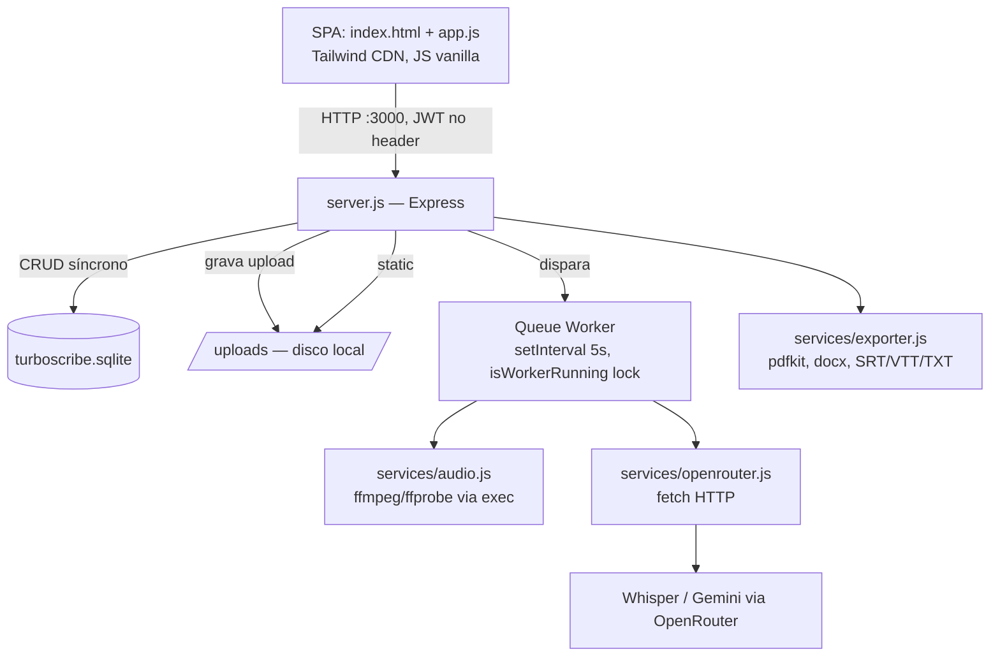
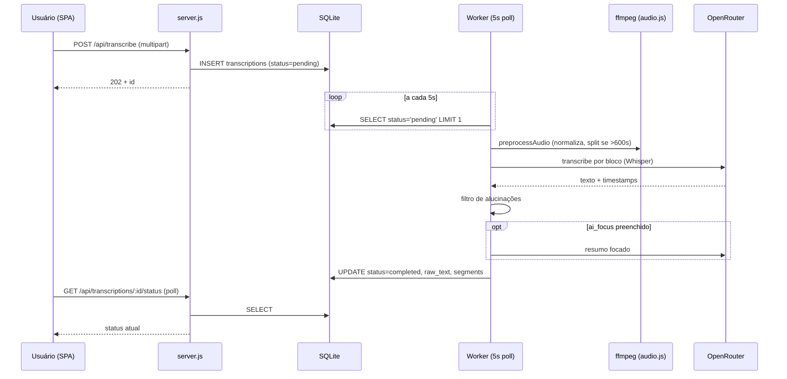

# system_design.md — Arquitetura e Decisões de Design

> Como as peças internas se conectam, por que foram desenhadas assim, e quais os tradeoffs assumidos conscientemente. Complementa [stack.md](stack.md) (inventário) com o raciocínio por trás das escolhas.

## Diagrama de componentes

## Decisões de design e o tradeoff aceito

### 1. Monolito de processo único (API + worker no mesmo processo Node)
**Decisão:** o worker de transcrição roda dentro do processo Express via `setInterval`, protegido por uma flag booleana `isWorkerRunning` (`server.js:594`), em vez de um processo separado ou fila externa (BullMQ/Redis).
**Por quê:** menor custo operacional e de infraestrutura — um único container, sem serviço adicional para manter.
**Tradeoff aceito:** concorrência de transcrição = 1 job global. `ffmpeg` roda via `exec` síncrono, competindo com o event loop do Express — a UI de outros usuários pode ficar lenta durante o pré-processamento. Ver [MULTIUSER.md](MULTIUSER.md) §B-04.
**Quando revisitar:** se o volume de uploads simultâneos crescer além de "alguns por dia por poucos usuários", extrair o worker para processo/serviço separado.

### 2. SQLite como único banco, sem WAL
**Decisão:** arquivo único `turboscribe.sqlite`, sem `PRAGMA journal_mode=WAL`.
**Por quê:** zero infraestrutura de banco, backup é copiar um arquivo.
**Tradeoff aceito:** escritas concorrentes (worker atualizando `progress` + usuários escrevendo) arriscam `SQLITE_BUSY` sob carga. Sem índices em `transcriptions.user_id/status` nem `segments.transcription_id` — cada poll da fila é um full scan.
**Quando revisitar:** antes de qualquer teste de carga com múltiplos usuários reais simultâneos (ver [MULTIUSER.md](MULTIUSER.md) §5).

### 3. Auth com fallback silencioso para admin
**Decisão:** `authenticateToken` (`server.js:51-67`) trata requisição sem header `Authorization` como usuário admin local.
**Por quê:** conveniência de desenvolvimento local single-tenant (uso original do sistema — só o dono operando).
**Tradeoff aceito — hoje é o bloqueador de segurança nº 1:** qualquer requisição sem token na rede vira admin. Isso não é dívida técnica incidental, é uma decisão que fazia sentido no contexto original (uso único) e deixou de fazer sentido no momento em que o sistema passa a ser multiusuário. Ver [MULTIUSER.md](MULTIUSER.md) §B-01/B-02.
**Quando revisitar:** antes de convidar qualquer segundo usuário real — é pré-requisito, não melhoria incremental.

### 4. Nenhuma query filtra por `user_id`
**Decisão:** todas as rotas de dados (`/api/projects`, `/api/transcriptions`, `/api/export`) leem/escrevem sem cláusula `WHERE user_id = ?`, embora a coluna exista e seja gravada.
**Por quê:** o schema já antecipava multiusuário, mas a camada de rotas nunca chegou a aplicar o filtro — o produto era usado por uma pessoa só.
**Tradeoff aceito:** vazamento cruzado total de dados entre usuários; qualquer um apaga o trabalho de qualquer outro. Ver [MULTIUSER.md](MULTIUSER.md) §B-03.
**Quando revisitar:** junto com o item 3, é a mesma classe de problema — tenancy não aplicada.

### 5. Front-end sem build step
**Decisão:** `index.html` + `app.js` em JS vanilla, Tailwind via CDN, sem bundler/TypeScript/framework.
**Por quê:** zero tempo de build, zero dependência de toolchain de front, deploy = servir arquivos estáticos direto do Express.
**Tradeoff aceito:** sem type-safety, sem tree-shaking, `app.js` já em 1617 linhas num único arquivo. Cache-busting manual via query string na tag `<script>` (`?v=X.Y.Z`).
**Quando revisitar:** se a complexidade de estado da SPA continuar crescendo além do que um único arquivo suporta legivelmente.

### 6. Pipeline de transcrição assíncrono com pré-processamento
**Decisão:** áudio passa por `ffmpeg` (normaliza para 16kHz mono FLAC + `loudnorm`) e, se > 600s, é dividido nos silêncios antes de ir para o Whisper por blocos; depois passa por um filtro de alucinações.
**Por quê:** Whisper degrada em arquivos longos e em áudio não normalizado; blocos menores custam menos e falham de forma mais isolada (um bloco ruim não derruba o áudio inteiro).
**Tradeoff aceito:** mais chamadas de API por áudio longo (custo), mais etapas que podem falhar individualmente, complexidade adicional em `services/audio.js`.
**Detalhe completo:** [../pipeline.md](../pipeline.md).

### 7. Bind-mount Docker para código, imagem para binários
**Decisão:** `.:/app` como bind-mount (hot-reload de `.js` só com `restart`), mas dependências de sistema (`ffmpeg`) só entram via rebuild de imagem.
**Por quê:** ciclo de iteração rápido para lógica de aplicação sem pagar o custo de rebuild a cada mudança de `.js`.
**Tradeoff aceito — já causou incidente real (31/08/2026):** código novo parece implantado (está, via mount) enquanto o binário que ele invoca não existe na imagem antiga, causando falha silenciosa até o primeiro job rodar.
**Regra operacional:** mexeu no `Dockerfile` → `docker compose build`. Mexeu só em `.js` → `docker compose restart transcreveai`.

## Fluxo de dados: do upload ao resultado

## Ver também
- [stack.md](stack.md) — inventário técnico e schema
- [system_product.md](system_product.md) — onde produto e sistema se acoplam
- [MULTIUSER.md](MULTIUSER.md) — auditoria de segurança e capacidade
- [../pipeline.md](../pipeline.md) — pipeline técnico de transcrição e Git Flow
