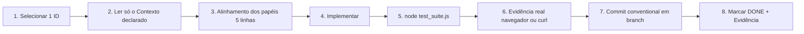

# workflow.md — Desenvolvimento Orientado a Contexto

> Como trabalhamos. Uma tarefa por vez, com contexto mínimo suficiente — foco em funcionalidade entregue, baixo custo de token e memória.
> Complementa [../pipeline.md](../pipeline.md) (pipeline técnico e Git Flow). Este arquivo define o protocolo de sessão.

## Os três princípios

1. **Uma tarefa por sessão.** A sessão abre com um único ID de [TASKS.md](TASKS.md) e fecha quando ele está `DONE`.
2. **Contexto sob demanda.** Não se lê o projeto inteiro. Cada tarefa declara seus arquivos de contexto; lê-se só eles.
3. **Evidência ou não aconteceu.** Toda entrega fecha com saída de teste real colada no commit ou no walkthrough.

## Contrato de contexto por sessão

```
### T-XX — Título
Estado: TODO | DOING | DONE | BLOCKED
Contexto: docs/stack.md §4, server.js:139-330
Toca: server.js, db.js
Aceite:
  - [ ] critério verificável 1
  - [ ] critério verificável 2
Evidência: (preenchido ao concluir — comando + saída)
```

**Regra de leitura:** o agente lê `AGENTS.md` + `docs/TASKS.md` + os arquivos listados em `Contexto`. Se descobrir uma dependência real, atualiza o campo `Contexto` da tarefa.

**Regra de escrita:** só os arquivos em `Toca`. Precisar de outro é sinal de tarefa mal recortada — pare e re-recorte.

## Ciclo de uma tarefa



### Passo 3 — Alinhamento (curto, obrigatório)
No máximo 5 linhas, uma por papel envolvido, dizendo o que cada um exige. Papéis em [`.agents/skills/`](../.agents/skills/).

### Passo 5/6 — Definition of Done
- `node test_suite.js` verde
- Se mexeu no `Dockerfile` → `docker compose build` + verificação dentro do container
- Fluxo validado ponta a ponta no ambiente real
- Nenhum segredo no diff

## Teste com arquivo base

`test_suite.js` e `tests/load_multiuser.js` sobem áudio de verdade e esperam transcrição real via OpenRouter — não há como testar o pipeline sem um arquivo de entrada. Esse arquivo **precisa ser versionado no repositório** para que:

- Qualquer pessoa que clona o projeto consiga rodar `node test_suite.js` no primeiro `npm install`, sem depender de `uploads/` (que é `.gitignore`d e só existe depois de uso real).
- Nenhum áudio real de cliente/atendimento seja usado em teste automatizado ou fique referenciado por nome de arquivo no código-fonte.

**Arquivo base:** [`tests/fixtures/sample.ogg`](../tests/fixtures/sample.ogg) — ~10s de voz sintética gerada por TTS (`System.Speech`, Windows), sem qualquer dado de cliente. `test_suite.js:9` e `tests/load_multiuser.js` resolvem esse caminho por padrão; `AUDIO_SAMPLE=/outro/caminho.ogg` sobrescreve quando quiser testar com um áudio maior/real localmente.

**Regra:** se `tests/fixtures/sample.ogg` for regenerado ou trocado, deixe o novo arquivo pequeno (< 100 KB, poucos segundos) — cada execução da suíte consome crédito real da OpenRouter.

## Pré-infra de organização do projeto

Antes de abrir qualquer tarefa nova, a sessão deve confirmar que a "pré-infra" abaixo está no lugar — é o que separa "código que roda na minha máquina" de "projeto que sobrevive a uma reinstalação, a outro computador, ou a outra pessoa assumindo":

| Item | Onde vive | Por quê importa |
|---|---|---|
| Remote Git configurado e com push recente | `git remote -v` → `origin` no GitHub | Sem isso, o único backup do projeto é o disco local — qualquer falha de máquina apaga tudo |
| `.env.example` cobrindo todas as variáveis usadas | [`.env.example`](../.env.example) | Quem clona precisa saber o que configurar sem ler `server.js` inteiro |
| `.gitignore` cobrindo segredo e dado sensível | [`.gitignore`](../.gitignore) | `.env`, `turboscribe.sqlite`, `uploads/` nunca podem ir para um repo público |
| Docker + Docker+Traefik documentados e testáveis do zero | [`docs/INSTALL.md`](INSTALL.md) | Reinstalar deve ser `git clone` + `docker compose up -d`, não uma sequência de passos na memória de uma pessoa |
| Arquivo de teste que não depende de dado local | `tests/fixtures/sample.ogg` (ver seção acima) | Ver acima |
| README.md descrevendo o projeto real | [`../README.md`](../README.md) | Onboarding começa aqui — se estiver errado (era o caso, T-10), tudo depois fica mais caro |
| Backlog vivo com prioridade de segurança visível | [`docs/TASKS.md`](TASKS.md) | Quem retoma o projeto depois de um tempo sabe por onde começar sem reauditar do zero |

**Quando revisitar:** a cada vez que o projeto for clonado numa máquina nova, ou antes de convidar qualquer colaborador — rodar o checklist acima como um `T-00` implícito.

## Economia de tokens e memória

| Faça | Não faça |
|---|---|
| `sed -n '139,330p' server.js` | `cat server.js` (~62 KB) |
| `grep -n "app\.\(get\|post\)" server.js` | Ler o arquivo inteiro para "entender o geral" |
| Consultar `docs/stack.md` para o schema | Rodar `.schema` e reler tudo do zero |
| Atualizar `docs/*.md` quando a realidade mudar | Deixar a doc envelhecer e reauditar depois |
| Fechar a sessão ao concluir a tarefa | Emendar a próxima tarefa na mesma sessão |

## Quando a doc precisa ser atualizada

| Mudou | Atualize |
|---|---|
| Rota nova/removida | `docs/stack.md` |
| Coluna/tabela | `docs/stack.md` |
| Tela ou funcionalidade visível | `docs/product.md` |
| Decisão de arquitetura ou tradeoff | `docs/system_design.md` |
| Fronteira de produto/sistema | `docs/system_product.md` |
| Etapa do processamento | `pipeline.md` |
| Limite de capacidade / segurança | `docs/MULTIUSER.md` |
| Variável de ambiente ou passo de instalação | `docs/INSTALL.md`, `.env.example`, `README.md` |
| Qualquer entrega | `docs/TASKS.md` (estado + evidência) |

Atualização de doc entra no mesmo commit da mudança. Doc atrasada é dívida de token.

## Papéis disponíveis

Ver [../AGENTS.md](../AGENTS.md) para o índice completo. Regra: no máximo 2 papéis por tarefa.

## Git Flow

| Prefixo | Uso |
|---|---|
| `feat/` | Nova funcionalidade |
| `fix/` | Correção de bug |
| `chore/` | Infra, build, deps, documentação |

Merge na `main` sempre com `--no-ff`, nunca commit direto na `main`. Detalhe completo em [../pipeline.md](../pipeline.md) §6.

## Ver também
- [product.md](product.md) · [stack.md](stack.md) · [system_product.md](system_product.md) · [system_design.md](system_design.md) · [INSTALL.md](INSTALL.md)
