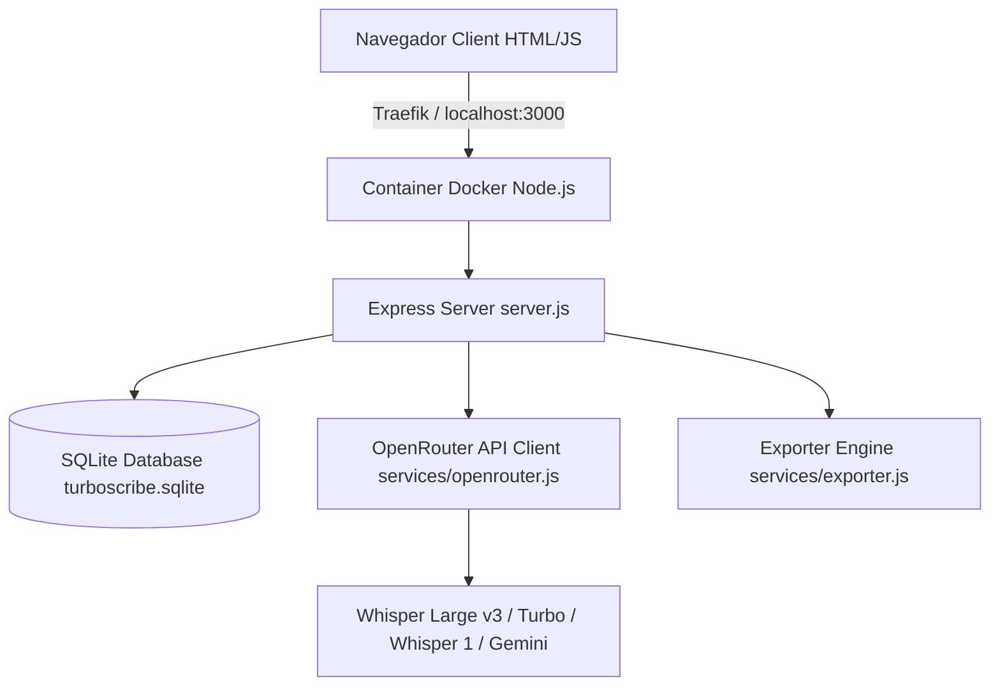

# 🔄 Pipeline de Desenvolvimento SaaS Orientado a Contexto (TurboScribe AI & Engineering Workflow)

Este documento estabelece a metodologia de **Desenvolvimento Orientado a Contexto (Context-Driven Development)** para ser seguida rigorosamente por agentes de Inteligência Artificial e engenheiros de software no projeto TurboScribe. O objetivo é garantir **máxima assertividade, zero regressões e alta qualidade de código e interface**.

---

## 📌 1. Princípios Fundamentais de Desenvolvimento

1. **Contexto Antes da Ação**: Nunca alterar código, esquemas do banco SQLite ou rotas de API sem antes inspecionar o código fonte real e a estrutura de dados existente.
2. **Zero Textos Fictícios (No Fake Fallbacks)**: Falhas ou instabilidades de API devem retornar erros explícitos e estruturados ou utilizar fallbacks com os dados reais do áudio enviado. Nunca injetar dados fictícios no banco.
3. **Validação Dupla Mandatória**: Toda funcionalidade precisa ser validada por:
   - **Suíte de Testes Automatizados (`node test_suite.js`)**
   - **Navegador e Evidência Visual (`browser_subagent` com capturas de tela)**
4. **Sincronização Docker Live — com uma ressalva crítica**: O container é configurado com *volume bind-mount* (`.:/app`), então alterações em **código JavaScript** refletem no container sem rebuild (basta `docker compose restart transcreveai` para o Node recarregar).
   - ⚠️ **O bind-mount NÃO instala dependências de sistema.** Qualquer coisa vinda do `Dockerfile` (binários via `apk add`, como o `ffmpeg`, variáveis `ENV`, `npm ci`) só existe no container após **rebuild da imagem**.
   - Isso é traiçoeiro: o código novo *parece* implantado (e está, via mount) enquanto o binário que ele invoca não existe. Foi exatamente a causa do incidente de 31/08/2026 (`/bin/sh: ffmpeg: not found`), em que 100% das transcrições falhavam com a imagem de 21/08.
   - **Regra:** mexeu no `Dockerfile` → `docker compose build && docker compose up -d`. Mexeu só em `.js` → `docker compose restart transcreveai`.

---

## 🏗️ 2. Arquitetura do Sistema



- **Core Backend**: `server.js` (Express + Upload Multer + Autenticação JWT + validação `ffprobe` por arquivo).
- **Worker de transcrição**: `services/pipeline.js` — um job por vez; dentro do job, blocos em paralelo com retry e retomada (detalhe em `docs/system_design.md` §6).
- **Áudio**: `services/audio.js` — `ffmpeg`/`ffprobe` via `spawn` (normalização 16 kHz mono FLAC + loudnorm, corte nos silêncios, filtro de alucinações).
- **Banco de Dados**: `db.js` (SQLite3 com tabelas `users`, `projects`, `transcriptions`, `transcription_chunks`, `segments`, `api_keys`, `system_settings`, `system_logs`).
- **Serviço de IA**: `services/openrouter.js` (Integração OpenRouter com cálculo de preços por segundo e métricas de acurácia PT-BR; `TRANSCRIBE_PROVIDER=mock` para testes de mecânica sem custo).
- **Frontend SPA**: `index.html` + `app.js` (Tailwind CSS, Lucide Icons, Audio Web API, Drag & Drop nativo).

### 2.1 Ciclo de um áudio longo (a partir de 15/09/2026)
`pending` → **preprocessing** (ffmpeg) → **splitting** (blocos de ~600 s no silêncio, 1 linha em `transcription_chunks` por bloco) → **transcribing** (`CHUNK_CONCURRENCY` blocos por vez; cada bloco persistido ao concluir; 429/5xx/rede → nova tentativa com backoff; erro definitivo → só o bloco fica `failed`) → **assembling** (ordem + offset + filtro de alucinações; bloco falho vira `[bloco N falhou: motivo]`) → **analyzing** (resumo focado, opcional) → `completed` | `completed_with_errors`.
Queda do processo no meio: o worker retoma o job `processing` e refaz só os blocos não concluídos. `POST /api/transcriptions/:id/retry` reprocessa só os `failed`. Testes de mecânica: `node tests/long_audio.js` (mock, custo zero).

---

## 📋 3. Fluxo Guiado Passo a Passo para Novas Tarefas (AI Step-by-Step Workflow)

### FASE 1: Investigação e Leitura de Contexto
- [ ] Ler a solicitação do usuário / especificação do produto.
- [ ] Inspecionar as tabelas relevantes no banco SQLite executando consultas curtas via Node.js.
- [ ] Verificar os endpoints ativos em `server.js` e as funções em `app.js`.

### FASE 2: Elaboração do Plano de Implementação (`implementation_plan.md`)
- [ ] Criar o plano de implementação detalhando:
  - Componentes que serão modificados/criados (`[MODIFY]` / `[NEW]`).
  - Mudanças de interface de usuário (UI/UX) e comportamento interativo.
  - Testes de verificação que serão executados.
- [ ] Obter a aprovação explícita do plano antes de iniciar grandes alterações.

### FASE 3: Implementação Incremental
- [ ] **Backend**: Adicionar/atualizar rotas de API em `server.js` ou novos métodos em `services/`.
- [ ] **Banco de Dados**: Atualizar comandos SQL em `db.js` mantendo retrocompatibilidade com dados existentes.
- [ ] **Frontend**: Atualizar a estrutura HTML em `index.html` e o estado da SPA em `app.js`.
- [ ] **Prevenção de Cache**: Incrementar a versão do script em `index.html` (`<script src="app.js?v=X.Y.Z"></script>`) e garantir que os cabeçalhos HTTP no-cache estão ativos.

### FASE 4: Execução do Loop de Testes e Validação
- [ ] Executar o script de teste de integração:
  ```bash
  node test_suite.js
  ```
  *(Todas as 32 asserções devem ser aprovadas com 100% de sucesso — ver Definition of Done na seção 6.2).*
- [ ] Executar o sub-agente de navegador (`browser_subagent`) para acessar a aplicação em `http://localhost:3000`, interagir com os novos elementos de UI e capturar screenshots de confirmação.

### FASE 5: Documentação e Versionamento (Commit & Walkthrough)
- [ ] Criar o relatório de entrega em `walkthrough.md` anexando as capturas de tela e evidências de sucesso.
- [ ] Versionar seguindo o **Git Flow** da seção 6 — nunca commitar direto na `main`.

---

## 🌱 6. Git Flow: a `main` sempre funcional

**Princípio:** a `main` é a linha do que comprovadamente funciona. Todo commit nela deve ter passado pelo Definition of Done abaixo. Trabalho em andamento vive em branch, não na `main`.

### 6.1 Branches
Branches curtas, com prefixo por tipo, criadas a partir da `main`:

| Prefixo | Uso |
|---|---|
| `feat/` | Nova funcionalidade (`feat/projetos-kanban`) |
| `fix/` | Correção de bug (`fix/ffmpeg-docker-build`) |
| `chore/` | Infra, build, deps, documentação (`chore/pipeline-git-flow`) |

```bash
git switch -c fix/nome-curto-do-problema main
```

### 6.2 Definition of Done (gate obrigatório antes de merge na `main`)
- [ ] `node test_suite.js` → **32/32**. Se um teste ficou obsoleto porque o comportamento mudou de propósito, **corrija o teste junto com a mudança** — suíte cronicamente vermelha não protege nada.
- [ ] Se mexeu no `Dockerfile`: imagem reconstruída e dependência verificada **dentro** do container.
- [ ] Fluxo validado de ponta a ponta no ambiente real (não só unitário) — para transcrição, um áudio real concluindo com `status='completed'` e texto coerente.
- [ ] Nenhum segredo no diff (`.env`, `turboscribe.sqlite` e `uploads/` são ignorados — mantenha assim).
- [ ] **`docs/TASKS.md` sincronizado no mesmo commit**: quadro **e** seção da tarefa em `DONE` com evidência. Task sem TASKS.md atualizada não fechou (regra completa em [docs/WORKFLOW.md](docs/WORKFLOW.md) — "Sincronização do TASKS.md").

### 6.3 Merge
Merge com `--no-ff` para preservar o agrupamento lógico da entrega:

```bash
git switch main
git merge --no-ff fix/nome-curto-do-problema
git branch -d fix/nome-curto-do-problema
```

### 6.4 Mensagens de commit (Conventional Commits)
Formato `tipo: resumo no imperativo`, com corpo explicando **causa e efeito**, não só o arquivo alterado.

```
fix: instala ffmpeg na imagem Docker para destravar a fila

O bind-mount .:/app publica o codigo novo, mas nao instala binarios.
services/audio.js passou a invocar ffmpeg, ausente na imagem de 21/08,
entao todo job morria em preprocessAudio.
```

**Commits atômicos:** uma correção de infra e uma nova funcionalidade são commits separados, ainda que descobertos na mesma sessão. Isso é o que torna `git revert` viável.

---

## ⚙️ 7. Guia de Referência Rápida de Modelos de IA e Preços

| Modelo OpenRouter | Preço / Minuto (USD) | Acurácia PT-BR | Recomendação |
|---|---|---|---|
| `openai/whisper-large-v3` | **$0.0060** | **99.2% ⭐ 5.0** | **Padrão Recomendado** (Máxima acurácia para sotaques e jargões PT-BR) |
| `openai/whisper-large-v3-turbo` | **$0.0030** | **97.8% ⭐ 4.8** | **Turbo** (Alta velocidade com excelente nível de detalhes) |
| `openai/whisper-1` | **$0.0060** | **96.5% ⭐ 4.5** | **Padrão OpenAI** (Excelente para conversas ágeis) |
| `google/gemini-2.0-flash-001` | **$0.0020** | **98.5% ⭐ 4.9** | **Ultra Barato** (Excelente custo-benefício multimodal) |

---

## 🛠️ 8. Comandos Úteis de Operação

```bash
# Inicializar o ambiente Docker em background com live mount
docker compose up -d

# Reiniciar o servico (recarrega o Node; use apos alterar arquivos .js)
docker compose restart transcreveai

# Rebuild da imagem (OBRIGATORIO apos alterar o Dockerfile - ex.: novos binarios)
docker compose build && docker compose up -d

# Conferir se as dependencias de sistema existem DENTRO do container
docker exec transcreveai-app sh -c 'ffmpeg -version | head -1'

# Reprocessar so os blocos que falharam de uma transcricao (ou o job inteiro, se falhou antes de fatiar)
curl -X POST http://localhost:3000/api/transcriptions/<ID>/retry

# Testar a mecanica de audio longo sem gastar credito (mock; gera o fixture antes)
powershell -File tests/fixtures/make-long-sample.ps1
node tests/long_audio.js

# Executar a suíte de testes de integração
node test_suite.js

# Verificar status do repositório Git
git status
```
