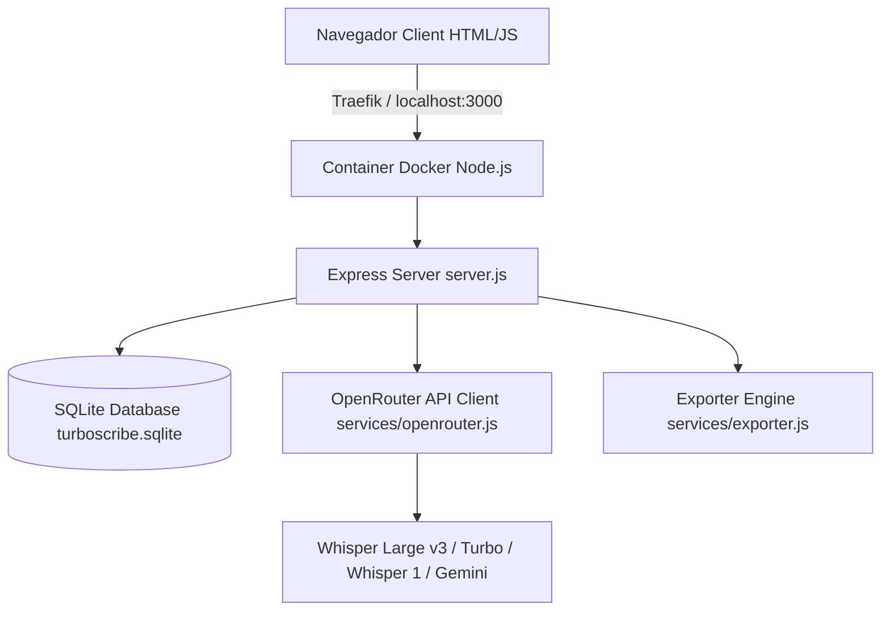

# 🔄 Pipeline de Desenvolvimento SaaS Orientado a Contexto (TurboScribe AI & Engineering Workflow)

Este documento estabelece a metodologia de **Desenvolvimento Orientado a Contexto (Context-Driven Development)** para ser seguida rigorosamente por agentes de Inteligência Artificial e engenheiros de software no projeto TurboScribe. O objetivo é garantir **máxima assertividade, zero regressões e alta qualidade de código e interface**.

---

## 📌 1. Princípios Fundamentais de Desenvolvimento

1. **Contexto Antes da Ação**: Nunca alterar código, esquemas do banco SQLite ou rotas de API sem antes inspecionar o código fonte real e a estrutura de dados existente.
2. **Zero Textos Fictícios (No Fake Fallbacks)**: Falhas ou instabilidades de API devem retornar erros explícitos e estruturados ou utilizar fallbacks com os dados reais do áudio enviado. Nunca injetar dados fictícios no banco.
3. **Validação Dupla Mandatória**: Toda funcionalidade precisa ser validada por:
   - **Suíte de Testes Automatizados (`node test_suite.js`)**
   - **Navegador e Evidência Visual (`browser_subagent` com capturas de tela)**
4. **Sincronização Docker Live**: O container Docker é configurado com *volume bind-mount* (`.:/app`). As alterações no código refletem instantaneamente no ambiente containerizado sem necessidade de re-builds manuais da imagem.

---

## 🏗️ 2. Arquitetura do Sistema



- **Core Backend**: `server.js` (Express + Upload Multer + Autenticação JWT).
- **Banco de Dados**: `db.js` (SQLite3 com tabelas `users`, `folders`, `transcriptions`, `segments`, `api_keys`, `settings`, `audit_logs`).
- **Serviço de IA**: `services/openrouter.js` (Integração OpenRouter com cálculo de preços por segundo e métricas de acurácia PT-BR).
- **Frontend SPA**: `index.html` + `app.js` (Tailwind CSS, Lucide Icons, Audio Web API, Drag & Drop nativo).

---

## 📋 3. Fluxo Guiado Passo a Passo para Novas Tarefas (AI Step-by-Step Workflow)

### FASE 1: Investigação e Leitura de Contexto
- [ ] Ler a solicitação do usuário / especificação do produto.
- [ ] Inspecionar as tabelas relevantes no banco SQLite executando consultas curtas via Node.js.
- [ ] Verificar os endpoints ativos em `server.js` e as funções em `app.js`.

### FASE 2: Elaboração do Plano de Implementação (`implementation_plan.md`)
- [ ] Criar o plano de implementação detalhando:
  - Componentes que serão modificados/criados (`[MODIFY]` / `[NEW]`).
  - Mudanças de interface de usuário (UI/UX) e comportamento interativo.
  - Testes de verificação que serão executados.
- [ ] Obter a aprovação explícita do plano antes de iniciar grandes alterações.

### FASE 3: Implementação Incremental
- [ ] **Backend**: Adicionar/atualizar rotas de API em `server.js` ou novos métodos em `services/`.
- [ ] **Banco de Dados**: Atualizar comandos SQL em `db.js` mantendo retrocompatibilidade com dados existentes.
- [ ] **Frontend**: Atualizar a estrutura HTML em `index.html` e o estado da SPA em `app.js`.
- [ ] **Prevenção de Cache**: Incrementar a versão do script em `index.html` (`<script src="app.js?v=X.Y.Z"></script>`) e garantir que os cabeçalhos HTTP no-cache estão ativos.

### FASE 4: Execução do Loop de Testes e Validação
- [ ] Executar o script de teste de integração:
  ```bash
  node test_suite.js
  ```
  *(Todas as 29+ asserções devem ser aprovadas com 100% de sucesso).*
- [ ] Executar o sub-agente de navegador (`browser_subagent`) para acessar a aplicação em `http://localhost:3000`, interagir com os novos elementos de UI e capturar screenshots de confirmação.

### FASE 5: Documentação e Versionamento (Commit & Walkthrough)
- [ ] Criar o relatório de entrega em `walkthrough.md` anexando as capturas de tela e evidências de sucesso.
- [ ] Realizar o commit no Git com mensagem padronizada:
  ```bash
  git add .
  git commit -m "feat: [Nome da Funcionalidade] - [Breve resumo dos arquivos e benefícios]"
  ```

---

## ⚙️ 4. Guia de Referência Rápida de Modelos de IA e Preços

| Modelo OpenRouter | Preço / Minuto (USD) | Acurácia PT-BR | Recomendação |
|---|---|---|---|
| `openai/whisper-large-v3` | **$0.0060** | **99.2% ⭐ 5.0** | **Padrão Recomendado** (Máxima acurácia para sotaques e jargões PT-BR) |
| `openai/whisper-large-v3-turbo` | **$0.0030** | **97.8% ⭐ 4.8** | **Turbo** (Alta velocidade com excelente nível de detalhes) |
| `openai/whisper-1` | **$0.0060** | **96.5% ⭐ 4.5** | **Padrão OpenAI** (Excelente para conversas ágeis) |
| `google/gemini-2.0-flash-001` | **$0.0020** | **98.5% ⭐ 4.9** | **Ultra Barato** (Excelente custo-benefício multimodal) |

---

## 🛠️ 5. Comandos Úteis de Operação

```bash
# Inicializar o ambiente Docker em background com live mount
docker compose up -d

# Reiniciar o serviço TurboScribe
docker compose restart turboscribe

# Executar a suíte de testes de integração
node test_suite.js

# Verificar status do repositório Git
git status
```
